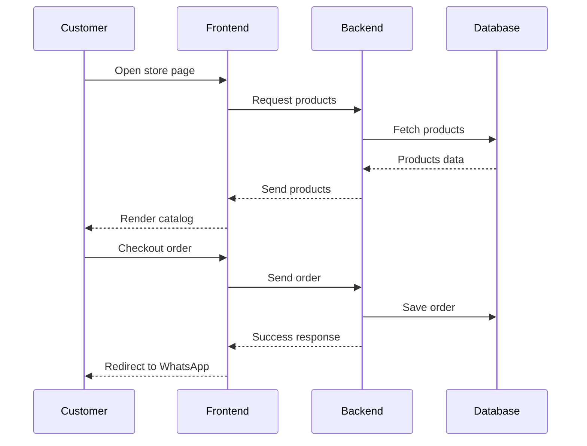
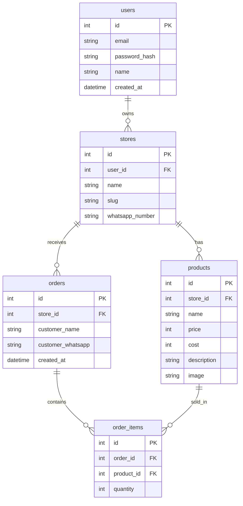

# PRD — Project Requirements Document

## 1. Product Overview

Aplikasi ini bertujuan membantu UMKM mengelola penjualan produk sekaligus menganalisis performa setiap produk secara otomatis.

Banyak UMKM menjual beberapa produk tetapi tidak memiliki data yang jelas mengenai produk mana yang benar-benar laku di pasar.

Tanpa data penjualan yang terstruktur, pemilik usaha sering memproduksi barang yang sebenarnya jarang dibeli sehingga menyebabkan pemborosan modal dan stok menumpuk.

Aplikasi ini menyediakan platform web sederhana yang memungkinkan pemilik UMKM untuk:

- Membuat halaman toko online
- Menerima pesanan dari pelanggan
- Mencatat penjualan secara otomatis
- Melihat analisis performa produk
- Mengetahui produk yang layak atau tidak layak diproduksi

Target utama aplikasi adalah **pemilik UMKM yang ingin menjual produk secara online tanpa sistem yang kompleks**.

---

# 2. Goals

## 2.1 Business Goals

- Membantu UMKM mengambil keputusan produksi berdasarkan data penjualan
- Mengurangi produk yang tidak laku
- Memberikan insight sederhana tentang performa produk

## 2.2 Product Goals

- Sistem order sederhana tanpa marketplace
- Pencatatan penjualan otomatis
- Dashboard analitik produk yang mudah dipahami

---

# 3. Target Users

## Admin (Pemilik UMKM)

Karakteristik:

- Tidak terlalu teknis
- Membutuhkan sistem yang sederhana
- Ingin mengetahui produk mana yang paling laku
- Ingin mengetahui stok produk mana yang hampir habis atau masih aman

Kebutuhan:

- Upload produk dengan mudah
- Menerima pesanan
- Melihat performa produk

## Customer (Pembeli)

Karakteristik:

- Datang dari link toko
- Menggunakan smartphone

Kebutuhan:

- Melihat katalog produk
- Order dengan cepat
- Checkout tanpa akun

---

# 4. Core Features (MVP)

## 4.1 Dashboard

Menampilkan ringkasan bisnis:

- Total Produk
- Total Pesanan
- Produk Paling Laris
- Produk Performa Rendah

## 4.2 Product Management

Admin dapat:

- Tambah Produk
- Edit Produk
- Hapus Produk

Field Produk:

| Field          | Required |
| -------------- | -------- |
| Nama Produk    | Yes      |
| Harga          | Yes      |
| Foto Produk    | Yes      |
| Stok           | Yes      |
| Deskripsi      | Yes      |
| Biaya Produksi | Optional |

## 4.3 Store Page

Setiap toko memiliki halaman publik:

```
/toko/{slug}
```

Menampilkan:

- Foto produk
- Nama produk
- Harga
- Tombol tambah keranjang

## 4.4 Cart

Customer dapat:

- Menambahkan produk
- Mengubah jumlah produk
- Menghapus produk

## 4.5 Checkout

Input checkout:

- Nama customer
- Nomor WhatsApp

Setelah checkout:

1. Order disimpan
2. Customer diarahkan ke WhatsApp penjual

## 4.6 Automatic Sales Recording

Setiap order otomatis menyimpan:

- Produk
- Jumlah
- Waktu transaksi

Admin tidak perlu input manual.

## 4.7 Product Performance Analysis

Sistem menghitung:

- Total penjualan per produk
- Rata-rata penjualan

Status produk:

- Laris
- Stabil
- Tidak Layak

---

# 5. User Flow

## Admin Flow

1. Login
2. Setup toko
3. Tambah produk
4. Share link toko
5. Monitor dashboard

## Customer Flow

1. Buka link toko
2. Lihat produk
3. Tambah ke keranjang
4. Checkout
5. Redirect ke WhatsApp

---

# 6. UI Pages (Preview)

## 6.1 Admin Pages

1. Dashboard
2. Products
3. Orders
4. Store Settings

Total halaman admin: **4 halaman**

## 6.2 Customer Pages

1. Store Page
2. Cart
3. Checkout

---

# 7. System Architecture



---

# 8. Database Schema



---

# 9. Technical Stack (Suggested)

Frontend

- Next.js
- TailwindCSS
- Shadcn UI

Backend

- Next.js API

Database

- PostgreSQL
- Prisma ORM
- Vercel Blob (Image Storage)

Deployment

- Vercel (frontend & backend)

---

# 10. Performance Targets

- Store page load < 2s
- Dashboard load < 2s
- Mobile responsive

---

# 11. Future Features

Fitur yang dapat ditambahkan setelah MVP:

- Export laporan penjualan
- Grafik penjualan
- Multi user admin
- Integrasi payment gateway (Midtrans)
- Notifikasi Email otomatis
